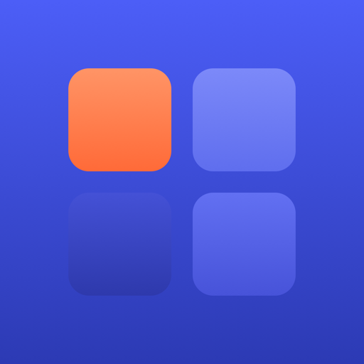

<div align="center">
  

  # Nexus

  **A menu bar companion for macOS Spaces — named desktops, colored identities, and instant switching, built entirely on top of Mission Control rather than around it.**

  [](#requirements)
  [](LICENSE)
</div>

---

## Why Nexus

macOS Spaces are powerful, but Mission Control treats them as anonymous, numbered rectangles — no names, no colors, no way to jump straight to "Design" or "Client Work" without first seeing every desktop laid out in front of you. Nexus sits in your menu bar and gives every desktop an identity: a name, a color, an icon, a keyboard shortcut, even a screenshot of what you left there — while leaving Mission Control itself completely in charge of actually managing them.

Nexus never replaces Mission Control, forks its own private copy of Spaces, or maintains a shadow model of your desktops that can drift out of sync. Every switch, every creation, every deletion goes through the real system, the same way your trackpad gesture or F3 key press does.

## Features

**Menu bar, your way**
- A status item that shows the active desktop as its colored dot and name, a plain icon, its number, or its first letter — pick whichever reads best at a glance, with a live preview of each option right in Settings.
- Right-click the status item for quick actions (Settings, check for updates, quit) without opening the full menu.

**The quick switcher**
- An optional pill, centered in the menu bar, that expands on hover into a full grid of every desktop — switch without ever opening the main menu. Notch-aware on notched MacBooks, so it never sits behind the camera housing.
- Each tile shows a "last-seen" screenshot of that desktop (opt-in, since macOS only renders the desktop you're actually looking at — this is a snapshot from the last time you were there, refreshed on every switch, never uploaded anywhere).

**Make every desktop yours**
- Custom names, since macOS has no concept of one.
- A curated accent color per desktop, shown consistently everywhere — the menu bar, the quick switcher, the management window.
- A custom icon from a curated set of SF Symbols, standing in for the plain desktop number.

**Automate the busywork**
- Assign apps to a desktop that launch automatically (if not already running) the moment you switch there — have your tools ready without a Dock-icon trick that macOS doesn't actually support for third parties.
- Global keyboard shortcuts for numbered slots (⌃⌥⌘1–9) *and* shortcuts bound to a specific desktop by identity, so they keep working even after you reorder or rename it.
- One click ("flash-free switching") assigns macOS's own built-in "Switch to Desktop N" shortcuts across all your desktops, so everyday switching never triggers Mission Control's animation at all.

**Everything else you'd expect**
- A full Manage Desktops window for creating, deleting, and customizing every desktop in one place.
- A Permissions dashboard that shows exactly what Nexus can access and why, with one-click recovery if a permission gets revoked.
- Automatic update checks via Sparkle, notarized and signed for distribution outside the Mac App Store.

## How Nexus complements Mission Control

Nexus is built entirely on Apple's public Accessibility framework, driving Mission Control's own on-screen UI the same way a person would — reading its desktop list, pressing its buttons, watching its state. It never uses undocumented private APIs to move windows or spaces directly, by design: that's what keeps Nexus working across macOS 26 and every release after it, rather than breaking the moment Apple changes something it was never supposed to depend on.

The result is a tool that feels like a natural extension of Mission Control, not a replacement fighting it for control of your desktops.

## Requirements

- macOS 26 or later
- **Accessibility** access (required) — Nexus reads and controls Mission Control's own UI to switch, create, and delete desktops. It does not log keystrokes, read other apps' content, or send anything over the network.
- **Screen Recording** access (optional) — only needed for the last-seen desktop previews in the quick switcher. Everything else works without it.

## Installation

Download the latest release from the [Releases](https://github.com/MikeManzo/Nexus/releases) page, move `Nexus.app` to `/Applications`, and launch it. Nexus lives in the menu bar only — it won't add a Dock icon.

## Building from source

Nexus uses [XcodeGen](https://github.com/yonaskolb/XcodeGen) to generate its Xcode project from `project.yml`, so the `.xcodeproj` itself isn't checked in.

```bash
brew install xcodegen
xcodegen generate
open Nexus.xcodeproj
```

Build and run the `Nexus` scheme in Xcode.

## License

Nexus is free software, licensed under the [GNU General Public License v3.0](LICENSE) or later.

## Acknowledgments

Update checks are powered by [Sparkle](https://github.com/sparkle-project/Sparkle).
